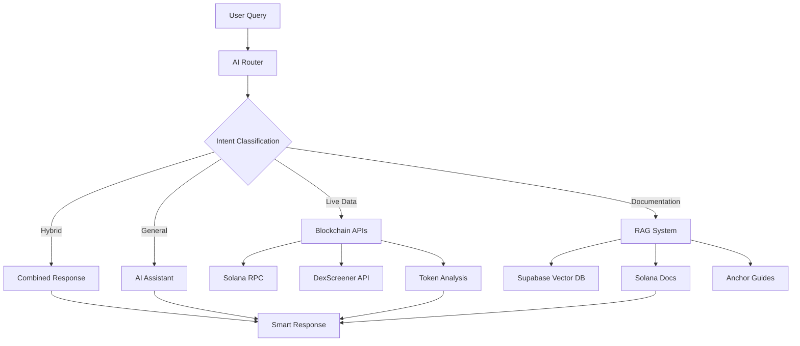

# Qognita - ChatGPT for Solana

> **AI-Powered Web3 Intelligence Platform for the Solana Ecosystem**

[](https://nextjs.org/)
[](https://www.typescriptlang.org/)
[](https://solana.com/)
[](https://openai.com/)
[](https://mor.org/)

## What is Qognita?

Qognita is a **production-ready AI-powered Web3 intelligence platform** specifically designed for the Solana ecosystem. Think "ChatGPT for Solana" with superpowers - users can ask natural language questions about wallets, tokens, transactions, security analysis, and tokenomics, getting intelligent responses that combine **live blockchain data**, **security analysis**, **conversational memory**, and **decentralized AI**.

### The Problem We Solve

- **Fragmented Information**: Solana data is scattered across block explorers, docs, and APIs
- **Technical Barriers**: Non-technical users struggle with complex blockchain interfaces  
- **Security Risks**: Users can't easily identify honeypots, rug pulls, and malicious tokens
- **Tokenomics Complexity**: Creating professional token economics requires deep market knowledge
- **Lost Context**: Traditional tools don't remember conversation history

### Our Solution

**One intelligent conversational platform** that:
- 🔍 Analyzes live blockchain data in real-time
- 🛡️ Detects security risks with AI-powered honeypot detection
- 💰 Generates professional tokenomics using decentralized AI
- 🧠 Remembers full conversation context for natural follow-ups
- ⚡ Provides instant, actionable insights

## Architecture Overview



## Key Features

### 🧠 **Conversational Memory**
- **Full Context Retention**: Remembers entire conversation history
- **Natural Follow-ups**: Ask "Any honeypot patterns?" after token analysis
- **Multi-turn Analysis**: Build complex queries across multiple messages
- **Context-Aware Responses**: AI understands what you're referring to

### 🛡️ **Advanced Security Analysis**
- **Honeypot Detection**: AI-powered risk scoring (0-10 scale)
- **Authority Checks**: Detects active mint/freeze authorities (CRITICAL risks)
- **Liquidity Analysis**: Identifies low liquidity risks
- **Holder Concentration**: Analyzes token distribution patterns
- **Price Volatility**: Flags extreme price movements
- **Comprehensive Reports**: Detailed risk factors with impact explanations

### 💰 **Professional Tokenomics Generation**
- **Powered by Morpheus AI**: Decentralized AI for Web3-native tokenomics
- **Distribution Models**: Community, team, treasury, liquidity allocations
- **Vesting Schedules**: Professional time-based release strategies
- **Token Utilities**: Governance, staking, fee discounts, platform access
- **Economic Mechanisms**: Deflationary burns, inflationary rewards
- **Risk Analysis**: Comprehensive risk assessment and mitigation strategies

### 🔍 **Live Blockchain Integration**
- **Multi-RPC Fallback**: Reliable data fetching across multiple Solana RPC endpoints
- **Real-time Analysis**: Wallet balances, token holdings, transaction history
- **Smart Address Classification**: Automatically detects wallets, tokens, programs, transactions
- **Transaction Parsing**: Detailed instruction-level analysis

### 🤖 **Intelligent AI Router**
- **Intent Classification**: Automatically determines query type (blockchain, security, tokenomics)
- **Tool Selection**: Chooses the right tools from 10+ specialized functions
- **Graceful Fallbacks**: Handles errors and provides alternative responses
- **Source Attribution**: Always shows where information comes from

## Technical Stack

### **Frontend**
- **Next.js 14** - React framework with App Router
- **TypeScript** - Type-safe development
- **Tailwind CSS** - Utility-first styling
- **React Markdown** - Rich text rendering

### **Backend & AI**
- **OpenAI GPT-4o** - Primary language model for intent classification and responses
- **Morpheus AI** - Decentralized AI for tokenomics generation (✅ **INTEGRATED**)
- **Custom AI Router** - Intelligent query routing with conversational memory
- **Function Calling** - 10+ specialized tools for blockchain, security, and tokenomics
- **Conversational Memory** - Full context retention across messages

### **Blockchain Integration**
- **@solana/web3.js** - Core Solana interactions
- **Multiple RPC Providers** - Reliability and rate limit management
- **DexScreener API** - Token market data
- **Enhanced Analysis Services** - Security and risk assessment

### **Data & Storage**
- **Supabase** - PostgreSQL with pgvector for embeddings
- **Firebase Auth** - User authentication and management
- **Vector Embeddings** - Semantic document search

## Demo Scenarios

### **🛡️ Security Analysis with Conversational Memory**
```
User: "Analyze token 4Bf3MmVBm94pMcXmnUfWrG95AApZHuEbGoztdGAxpump"

Qognita: 
"Token Name: nose
Total Supply: 1,867,717,053 tokens
Market Price: $0.0003567
Mint Authority: Active ⚠️
Freeze Authority: Active ⚠️"

User: "Any honeypot patterns?"

Qognita:
"⚠️ CRITICAL RISKS DETECTED:
Risk Score: 8/10

1. Mint Authority Active (CRITICAL)
   Impact: Creator can mint unlimited tokens, devaluing your holdings to zero

2. Freeze Authority Active (CRITICAL)
   Impact: Creator can freeze your tokens, making them unsellable

Recommendation: Exercise extreme caution. Do not invest."
```

### **💰 Professional Tokenomics Generation**
```
User: "Generate tokenomics for a Solana DeFi protocol called SolSwap"

Qognita:
"Here's comprehensive tokenomics for SolSwap:

📊 TOTAL SUPPLY: 1,000,000,000 SOLSWAP

📈 DISTRIBUTION:
• 40% Community (400M) - No vesting, airdrops & rewards
• 20% Team (200M) - 4-year linear vesting
• 25% Treasury (250M) - Controlled release for development
• 15% Liquidity (150M) - Immediate for DEX trading

⚡ UTILITIES:
• Governance voting on protocol upgrades
• Staking rewards (8-15% APY)
• Trading fee discounts (up to 50%)
• Platform access to premium features

🔥 ECONOMIC MECHANISMS:
• Deflationary: 2% of transaction fees burned quarterly
• Staking rewards for liquidity providers
• Dynamic fee structure based on volume

🏛️ GOVERNANCE:
• Token-weighted voting
• Community proposal system
• Treasury management by DAO

⚠️ RISKS & MITIGATION:
• Market volatility → Diversified treasury
• Regulatory changes → Compliance framework
• Competition → Strong community focus"
```

### **🔍 Wallet Analysis**
```
User: "What tokens does wallet 7xKXtg2CW87d97TXJSDpbD5jBkheTqA83TZRuJosgAsU hold?"

Qognita: 
- Fetches live wallet data
- Analyzes token holdings with current values  
- Provides portfolio breakdown
- Automatically flags risky tokens
```

### **📊 Transaction Analysis**
```
User: "Analyze transaction rmDMBs6h39FyX4gnihfv7PNz1k46rknsm5LU4KKbux8..."

Qognita:
- Parses transaction instructions
- Shows token transfers and amounts
- Identifies program interactions
- Explains what happened in plain English
```

## Getting Started

### Prerequisites
- Node.js 18+
- OpenAI API key
- Morpheus API key (get from [mor.org](https://mor.org))
- Supabase account (optional for RAG features)
- Firebase project (optional for authentication)

### Installation

1. **Clone the repository**
```bash
git clone https://github.com/Qognita/qognita
cd qognita
```

2. **Install dependencies**
```bash
npm install
```

3. **Set up environment variables**
```bash
cp .env.example .env.local
```

Fill in your API keys:
```env
# Required - OpenAI for AI routing and responses
OPENAI_API_KEY=your_openai_key
OPENAI_MODEL=gpt-4o

# Required - Morpheus AI for tokenomics generation
MORPHEUS_API_KEY=your_morpheus_key
MORPHEUS_API_URL=https://api.mor.org/api/v1
MORPHEUS_MODEL_ID=mistral-31-24b

# Optional - Solana RPC (has defaults)
NEXT_PUBLIC_SOLANA_RPC_URL=https://api.mainnet-beta.solana.com

# Optional - For RAG features
NEXT_PUBLIC_SUPABASE_URL=your_supabase_url
SUPABASE_SERVICE_ROLE_KEY=your_supabase_key

# Optional - For authentication
FIREBASE_API_KEY=your_firebase_key
```

4. **Start the development server**
```bash
npm run dev
```

Visit `http://localhost:3000` to see Qognita in action!

### Deploy to Vercel

1. **Push to GitHub**
```bash
git push origin main
```

2. **Connect to Vercel**
- Import your repository on [vercel.com](https://vercel.com)
- Add environment variables (OPENAI_API_KEY, MORPHEUS_API_KEY, etc.)
- Deploy!

Your Qognita will be live in minutes! 🚀

## Project Structure

```
src/
├── app/                    # Next.js App Router
│   ├── api/               # API routes
│   │   ├── chat-rag/      # Main RAG chat endpoint
│   │   ├── chat-enhanced/ # Live blockchain data
│   │   └── analyze-fast/  # Quick security analysis
│   ├── dashboard/         # Main chat interface
│   └── page.tsx          # Landing page
├── components/            # React components
│   ├── auth/             # Authentication
│   ├── chat/             # Chat interface
│   └── layout/           # Layout components
├── lib/                  # Core utilities
│   ├── aiRouter.ts       # Intelligent query routing
│   ├── ai-tools.ts       # 10+ specialized AI tools
│   ├── openai.ts         # OpenAI & Morpheus clients
│   └── types/            # TypeScript definitions
├── services/             # External integrations
│   ├── solana-tools.ts   # Blockchain data functions
│   ├── security-tools.ts # Honeypot detection & risk analysis
│   ├── tokenomics-tools.ts # Morpheus-powered tokenomics
│   └── knowledgeService.ts # RAG system (optional)
└── contexts/             # React contexts
```

## Project Highlights

### **Innovation**
- **First Web3 intelligence platform** with conversational memory
- **AI-powered honeypot detection** with risk scoring
- **Decentralized AI tokenomics** using Morpheus
- **Seamless UX** - complex blockchain queries in natural language

### **Technical Excellence**
- **Production-ready** - Deployed on Vercel, fully functional
- **Multi-RPC fallback** for 99.9% uptime
- **Conversational memory** - Full context retention
- **10+ specialized tools** for blockchain, security, and tokenomics
- **Graceful error handling** and fallbacks

### **User Impact**
- **Protects users** with automatic security analysis
- **Empowers creators** with professional tokenomics generation
- **Lowers barriers** for Solana newcomers
- **Accelerates decisions** with instant, actionable insights

### **Scalability**
- **Serverless architecture** on Vercel
- **Decentralized AI** via Morpheus
- **Modular design** for easy feature additions
- **Type-safe** with full TypeScript coverage

## What Makes This Production-Ready

✅ **Fully Functional**: All features work on Vercel
✅ **Error Handling**: Graceful fallbacks for every API call
✅ **Conversational**: Remembers full conversation context
✅ **Secure**: Real-time honeypot detection and risk analysis
✅ **Decentralized**: Morpheus AI for Web3-native tokenomics
✅ **Type-Safe**: Complete TypeScript coverage
✅ **Tested**: Proven with real Solana transactions and tokens

## Future Roadmap

- 🔄 **Enhanced RAG**: Expand documentation coverage
- 🌐 **Multi-Chain**: Extend to Ethereum, Base, Arbitrum
- 📱 **Mobile App**: Native iOS/Android applications  
- 🤖 **Multi-Agent**: Specialized agents for DeFi, NFTs, Gaming
- 📊 **Analytics Dashboard**: User insights and query optimization
- 🔌 **Plugin System**: Custom tools for specific protocols

## License

This project is licensed under the MIT License - see the [LICENSE](LICENSE) file for details.

## Acknowledgments

- **Solana Foundation** for the incredible blockchain platform
- **OpenAI** for powerful language models (GPT-4o)
- **Morpheus AI** for decentralized AI infrastructure
- **Solana Developer Community** for comprehensive documentation

---

**Built with ❤️ for the Solana ecosystem**

[Live Demo](https://qognita.vercel.app) | [Documentation](./FINAL_SUMMARY.md) | [Twitter](https://twitter.com/qognita)