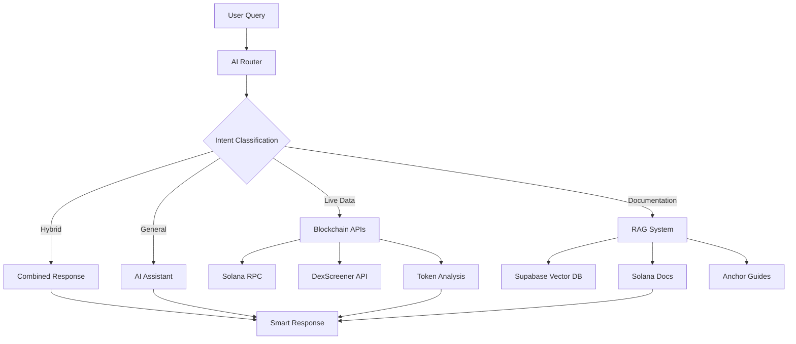

# Qognita - ChatGPT for Solana

> **AI-Powered Conversational Interface for the Solana Ecosystem**

[](https://nextjs.org/)
[](https://www.typescriptlang.org/)
[](https://solana.com/)
[](https://openai.com/)
[](https://firebase.google.com/)

## What is Qognita?

Qognita is the **first AI-powered conversational interface** specifically designed for the Solana ecosystem. Think "ChatGPT for Solana" - users can ask natural language questions about wallets, tokens, transactions, DeFi protocols, and development concepts, getting intelligent responses that combine **live blockchain data** with **comprehensive documentation**.

### The Problem We Solve

- **Fragmented Information**: Solana data is scattered across block explorers, docs, and APIs
- **Technical Barriers**: Non-technical users struggle with complex blockchain interfaces  
- **Developer Friction**: Finding relevant documentation and debugging takes too long
- **Security Concerns**: Users can't easily assess token/wallet risks

### Our Solution

**One conversational interface** that intelligently routes queries to the right data sources and provides contextual, actionable responses.

## Architecture Overview



## Key Features

### **Intelligent AI Router**
- **Intent Classification**: Automatically determines if queries need live data, documentation, or both
- **Context Awareness**: Maintains conversation history for follow-up questions
- **Source Attribution**: Always shows where information comes from

### **Live Blockchain Integration**
- **Multi-RPC Fallback**: Reliable data fetching across multiple Solana RPC endpoints
- **Real-time Analysis**: Wallet balances, token holdings, transaction history
- **Smart Address Classification**: Automatically detects wallets, tokens, programs, transactions
- **Security Scanning**: Built-in honeypot detection and risk assessment

### **RAG-Powered Documentation**
- **Vector Search**: Semantic search through indexed Solana documentation
- **Auto-Ingestion**: Automated scraping and indexing of official docs
- **Contextual Responses**: Combines multiple doc sources for comprehensive answers

### **Security-First Approach**
- **Risk Detection**: Automatic security analysis when addresses are mentioned
- **Pattern Recognition**: Identifies suspicious token/wallet behavior
- **User Protection**: Warns about potential scams and rug pulls

## Technical Stack

### **Frontend**
- **Next.js 14** - React framework with App Router
- **TypeScript** - Type-safe development
- **Tailwind CSS** - Utility-first styling
- **React Markdown** - Rich text rendering

### **Backend & AI**
- **OpenAI GPT-4o** - Primary language model and conversational interface
- **Custom AI Router** - Intelligent query routing
- **Function Calling** - Structured blockchain data retrieval
- **Morpheus AI** - Specialized token account parsing (planned integration)

### **Blockchain Integration**
- **@solana/web3.js** - Core Solana interactions
- **Multiple RPC Providers** - Reliability and rate limit management
- **DexScreener API** - Token market data
- **Enhanced Analysis Services** - Security and risk assessment

### **Data & Storage**
- **Supabase** - PostgreSQL with pgvector for embeddings
- **Firebase Auth** - User authentication and management
- **Vector Embeddings** - Semantic document search

## Demo Scenarios

### **Wallet Analysis**
```
User: "What tokens does wallet 7xKXtg2CW87d97TXJSDpbD5jBkheTqA83TZRuJosgAsU hold?"

Qognita: 
- Fetches live wallet data
- Analyzes token holdings with current values  
- Provides portfolio breakdown
- Flags any risky tokens automatically
```

### **Developer Support**
```
User: "How do I create a PDA in Anchor? Show me the code."

Qognita:
- Searches Anchor documentation
- Provides step-by-step guide
- Shows actual code examples
- Explains the concepts clearly
```

### **DeFi Analysis**
```
User: "How do Jupiter swaps work? Show me a recent swap transaction."

Qognita:
- Explains Jupiter protocol from docs
- Fetches real swap transaction
- Breaks down transaction instructions
- Shows token movements and fees
```

### **Security Check**
```
User: "Is this token safe? [token address]"

Qognita:
- Runs comprehensive security analysis
- Checks for honeypot indicators
- Analyzes holder distribution
- Provides risk assessment with reasoning
```

## Getting Started

### Prerequisites
- Node.js 18+
- OpenAI API key
- Supabase account
- Firebase project

### Installation

1. **Clone the repository**
```bash
git clone https://github.com/Qognita/qognita
cd qognita
```

2. **Install dependencies**
```bash
npm install
```

3. **Set up environment variables**
```bash
cp .env.example .env.local
```

Fill in your API keys:
```env
OPENAI_API_KEY=your_openai_key
NEXT_PUBLIC_SUPABASE_URL=your_supabase_url
SUPABASE_SERVICE_ROLE_KEY=your_supabase_key
# ... other keys
```

4. **Set up the database**
```bash
# Run the SQL setup in Supabase
psql -f supabase-setup.sql
```

5. **Ingest documentation (optional)**
```bash
npm run ingest-docs
```

6. **Start the development server**
```bash
npm run dev
```

Visit `http://localhost:3000` to see Qognita in action!

## Project Structure

```
src/
├── app/                    # Next.js App Router
│   ├── api/               # API routes
│   │   ├── chat-rag/      # Main RAG chat endpoint
│   │   ├── chat-enhanced/ # Live blockchain data
│   │   └── analyze-fast/  # Quick security analysis
│   ├── dashboard/         # Main chat interface
│   └── page.tsx          # Landing page
├── components/            # React components
│   ├── auth/             # Authentication
│   ├── chat/             # Chat interface
│   └── layout/           # Layout components
├── lib/                  # Core utilities
│   ├── aiRouter.ts       # Intelligent query routing
│   ├── firebase.ts       # Authentication
│   └── types/            # TypeScript definitions
├── services/             # External integrations
│   ├── solana.ts         # Blockchain interactions
│   ├── knowledgeService.ts # RAG system
│   └── solana-tools.ts   # Function calling tools
└── contexts/             # React contexts
```

## Hackathon Highlights

### **Innovation**
- **First conversational AI** specifically for Solana ecosystem
- **Intelligent routing** between live data and documentation
- **Seamless UX** - complex blockchain queries in natural language

### **Technical Excellence**
- **Production-ready architecture** with proper error handling
- **Multi-RPC fallback** for reliability
- **Vector-based RAG** for accurate documentation retrieval
- **Real-time security analysis** with risk detection

### **User Impact**
- **Lowers barriers** for Solana newcomers
- **Accelerates development** with instant documentation access
- **Enhances security** with automatic risk warnings
- **Unifies fragmented** Solana information

### **Scalability**
- **Modular architecture** for easy feature additions
- **Caching strategies** for performance
- **Rate limiting** and error handling
- **Documentation auto-ingestion** for staying current

## Future Roadmap

- **Morpheus Integration**: Complete token account parsing with specialized AI models
- **Plugin System**: Custom tools for specific protocols
- **Mobile App**: Native iOS/Android applications  
- **Multi-Agent**: Specialized agents for different domains
- **Cross-Chain**: Extend to other blockchain ecosystems
- **Analytics**: User behavior insights and query optimization

## Contributing

We welcome contributions! Please see our [Contributing Guide](CONTRIBUTING.md) for details.

## License

This project is licensed under the MIT License - see the [LICENSE](LICENSE) file for details.

## Acknowledgments

- **Solana Foundation** for the incredible blockchain platform
- **OpenAI** for powerful language models
- **Supabase** for the vector database infrastructure
- **Solana Developer Community** for comprehensive documentation

---

[Live Demo](https://qognita.vercel.app) | [Twitter](https://twitter.com/qognita)